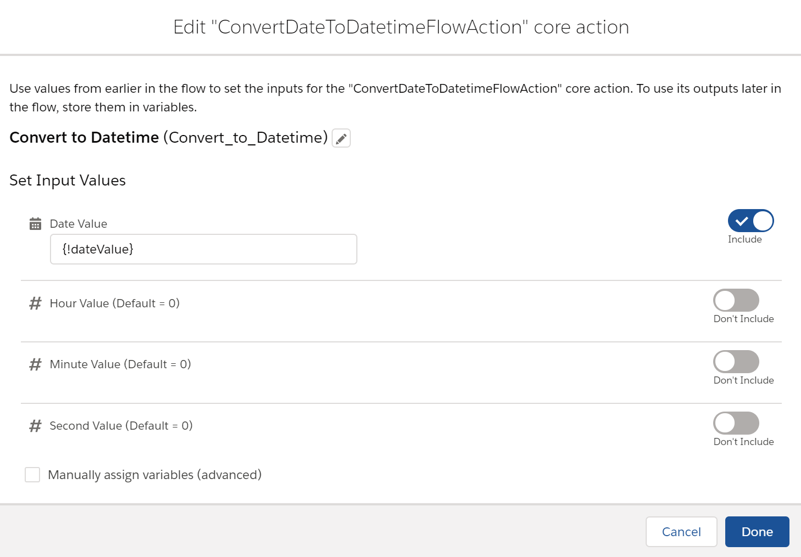

# ConvertDateToDatetimeFlowAction

It’s fairly easy to extract the Date portion of a Datetime value in a Flow formula.

**DATEVALUE({!datetimeValue})**

If {!datetimeValue} = **7/22/2020 5:00 PM** then the formula will return **July 22, 2020**.

It is a bit trickier to convert a Date value to a Datetime value using a formula. 

**DATETIMEVALUE(TEXT({!dateValue}) + " 00:00:00")**

If {!dateValue} = **July 22, 2020** you would want the formula to return **7/22/2020 12:00 AM**.  Instead the value returned will be converted to GMT so the result I get in Portland, Maine is **7/21/2020 8:00 PM**.  For me, that’s 4 hours ahead of GMT.

I could find no easy way to do time-zone calculations in Flow so I created a Flow Action that would keep everything in my current time-zone.

With this action, my result for **July 22, 2020** is **7/22/2020 12:00 AM**.
