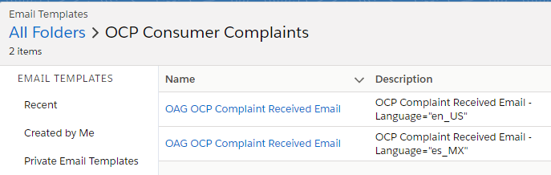
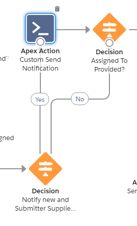
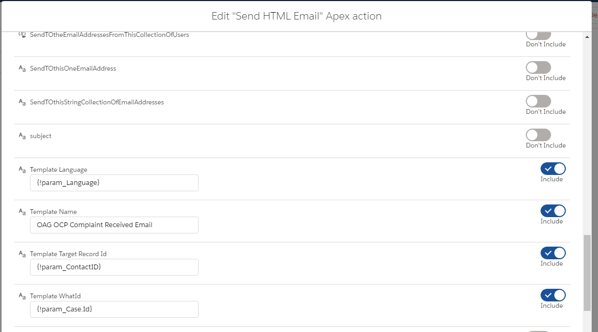

# Send HTML Email Flow Action

Learn More: https://unofficialsf.com/send-rich-email-with-the-new-sendhtmlemail-action/

With this fork, you can select the template to send based on language (multi-lingual template localization)

This component has been extended to allow for multi-lingual localization of templates selected on the basis of the initiating flow by using templateName (which queries available templates) and templateLanguage (which queries available templates with the 'Language="xx_YY"' tag embedded in the description.  It uses the matched template to generate the email.

