# Webhook2Flow Administrator&#39;s Guide
[Demonstration and Introduction Video(Part 1)](https://www.youtube.com/watch?v=a3y0UOgS354)

**Use Webhook2flow to connect Salesforce Flows to external system&#39;s webhooks**


**Webhook2flow facilitates webhook input processing by creating the interface and processing in Flow builder:**

 **Webhook Payload** 
---
 **url_verification** 
```json
    {
        "token": "Jhj5dZrVaK7ZwHHjRyZWjbDl",
        "challenge": "3eZbrw1aBm2rZgRNFdxV2595E9CY3gmdALWMmHkvFXO7tYXAYM8P",
        "type": "url_verification"
    }
```
**Define Interface in Flow**

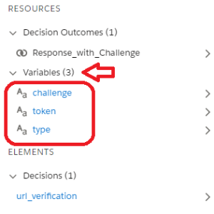 

**And use Flow Builder Logic to provide the service for that webhook:**


Webhook2Flow automates the creation and logic of webhook request receptors and services on Salesforce - almost completely in Flow Builder and without coding.

Webhooks facilitate real-time integration of information and systems through a web (HTTP) request to another system when an event occurs.  For example, if a record is created. changed, delete, . . ., it triggers a event that uses a webhook to communicate that change to your Salesforce system.

Webhooks are usually part of the standard interface extension of most systems that, out of the box, invoke behavior another in system when an event on the originating system occurs.

The way webhooks generally work, an event occurs and the source system makes an HTTP request to the URL configured for the webhook.   However, webhooks can be initiated on many systems as a standard part of their workflow or add-ons/extension capabilities.  Webhooks2flow can be used with just about any RESTful HTTP Request (see [OpenAPI](https://swagger.io/docs/specification/about/) for more information).

---

- 1 [OVERVIEW](#Webhook2FlowAdministrator&#39;sGuide-OVERVI)
- 2 [How Does This Work (The Basics)](#Webhook2FlowAdministrator&#39;sGuide-HowDoe)
- 3 [About Authentication and Authorization](#Webhook2FlowAdministrator&#39;sGuide-AboutA)
- 4 [Example Implementation - Step by Step for Slack app_mention (with url_verification)](#Webhook2FlowAdministrator&#39;sGuide-Exampl)
  - 4.1 [Development Tips for this Example:](#Webhook2FlowAdministrator&#39;sGuide-Develo)
  - 4.2 [Steps Illustrated in Slack app_mention Example](#Webhook2FlowAdministrator&#39;sGuide-StepsI)
  - 4.3 [2. Create the Salesforce endpoint to receive the webhook request](#Webhook2FlowAdministrator&#39;sGuide-2.Crea)
  - 4.4 [4. Create the Webhook2flow Data Interface (in Flow Builder)](#Webhook2FlowAdministrator&#39;sGuide-4.Crea)
  - 4.5 [5. Use Flow Builder to Service the request and build any needed response](#Webhook2FlowAdministrator&#39;sGuide-5.UseF)
    - 4.5.1 [Implement the Slack URL VERIFICATION HANDSHAKE flow path](#Webhook2FlowAdministrator&#39;sGuide-Implem)
  - 4.6 [Implement the Slack app_mention payload interface](#Webhook2FlowAdministrator&#39;sGuide-Implem)
  - 4.7 [Implement the Slack app_mention servicing logic](#Webhook2FlowAdministrator&#39;sGuide-Implem)
- 5 [Advanced Technical Information and Capabilities](#Webhook2FlowAdministrator&#39;sGuide-Advanc)
  - 5.1 [DataType Capabilities and Restrictions](#Webhook2FlowAdministrator&#39;sGuide-DataTy)
  - 5.2 [Specifying the HTTP Response StatusCode](#Webhook2FlowAdministrator&#39;sGuide-Specif)
    - 5.2.1 [Flow Error Example](#Webhook2FlowAdministrator&#39;sGuide-FlowEr)
- 6 [References](#Webhook2FlowAdministrator&#39;sGuide-Refere)
---
## OVERVIEW

If you are familiar with the concept of Webhooks and just want to  implement using webhooks2flow, just skip to here.

Most modern systems have the inherent capability of extending their capabilities through "[webhooks](https://en.wikipedia.org/wiki/Webhook)", a common API interface using standard Internet protocols and authentications.  For example, if I wanted to add a note on a contact every time that contact messaged in slack,  I could use the [Slack existing system hook](https://docs.gitlab.com/ee/system_hooks/system_hooks.html)  "message.im" that posts to a designated Salesforce end point .  This is a standard hook for Slack (among dozens of others) which requires no more setup than creating the  connection - using a recipient web end point to interpret and act on that request.

Most (if not all) state-of-the-art systems and services allow and utilize webhooks to automate transactions between applications, systems, and services and they are growing exponentially in popularity. .  A webhook can be a request for information or a request for an action.  Webhooks are increasingly available as extensions to system events and facilitate interaction with one or more external services when these events occur.

In today&#39;s world, customers expect a seamless customer experience - no matter if that experience consists of behind the scenes business solutions and services that reside on a single platform or across multiple off-platform hosts. Webhook2Flow is the inverse of Salesforce External Services.  External Services smooth the way for this exchange by letting you declaratively (no coding!) integrate with externally hosted services that perform a variety of business actions or computations for use in your Salesforce org.  Webhook2Flow allows you to let Other systems integrate with your Salesforce services using existing or created webhooks.

| **External Services** | **Webhook2Flow Services** |
| --- | --- |
| 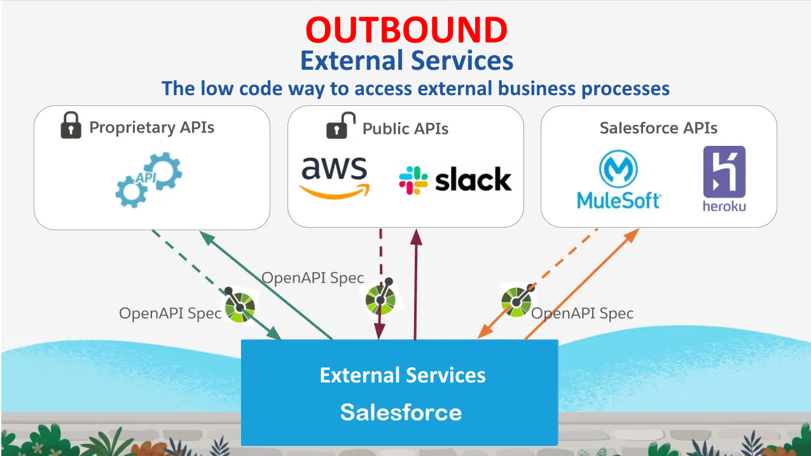 | 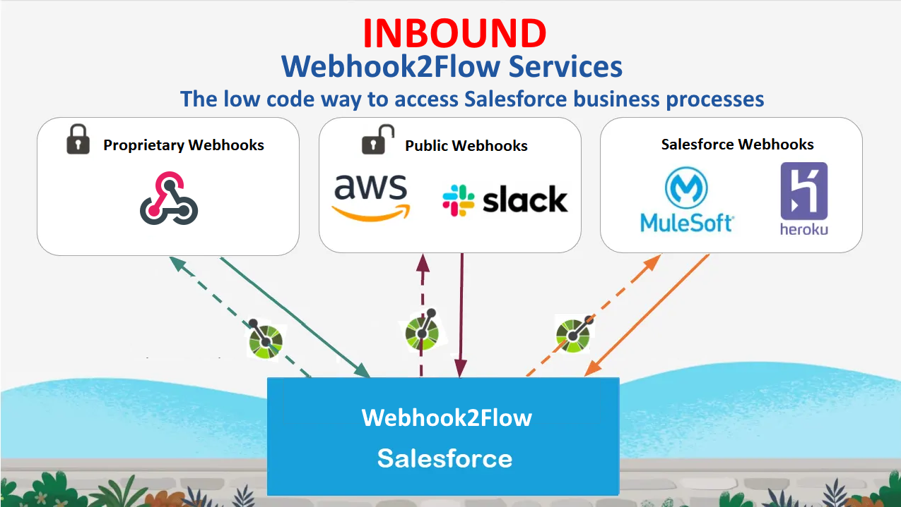 |

Webhook2Flow facilitates exposing a service (as a RESTful Web Service using JSON) entirely through flows and using any of the most common HTTP request interfaces.

The accessing webhook can use this same URL for every HTTP request type (e.g., DELETE, GET, PATCH, POST, PUSH).  The most commonly used is POST, but this supports them all.  For the taxonomy-oriented developers, you can have a single "category" for all of these (eg. [default_flow_APIName]).  If you support multiple request types for this function, this utility will automatically look for existing flows of the appended request type (e.g., default_flow_APIName_delete, default_flow_APIName_get, default_flow_APIName_patch, . . .), or you could specify each type specifically through the URL with different names.

5.  Use Flow Builder to Service the request and build any needed
    response.

Here are the basic steps to create a webhook2flow webhook receptor/servicer on a Salesforce instance.

1. Find (or create) the webhook you want to use from the external system.  On most state-of-the art systems, a reference guide exists of all the available webhooks and the payloads/response definitions needed to use them.
2. Create the Salesforce endpoint to _receive_ the webhook request.
3. Create a Webhook2Flow Endpoint Definition Custom Metadata Record to Define the webhook instance.  The SalesforceWebhook2Flow Endpoint Definition (Custom Metadata Type) record defines the endpoint and makes sure it is only used by the source system you authorize.
4. Create the Webhook2flow Data Interface (in Flow Builder)
  1. Request parameters are defined by marking variables as "Available for Input"
  2. Response parameters are defined by marking variables as "Available for Output"
5. Use Flow Builder to Service the request and build any needed response.
6. Use Flow Builder to Provide detailed and supportive Error conditions and helpful diagnostic error messages (if needed).
7. Define custom objects in the webhook definition using apex-defined classes (Advanced feature - use only if required)

When a system event occurs (examples; add a record, perform a query, update a record, a logic or time state change), by using a webhook, that system makes a request to your defined Webhook2Flow instance.  This utility allows your Salesforce system to service the requests of external systems directly in Flows without having to go through the hassle of setting up the "web service" (at least on the salesforce side).  It does so by making your flow the service handler.

For this example, let&#39;s use Slack.  Slack has a fairly mature set of webhooks available from a Slack App→Create a new app-->Event Subscriptions→Enable Events→Subscribe to bot events→[app_mention](https://api.slack.com/events/app_mention) and follow the above cookbook.

We&#39;re going to use it to post a note on the senders&#39; contact.

---

## About Authentication and Authorization

It is well beyond the scope of this implementation guide to explore the various mechanisms allowed/required in Salesforce for authentication and authorization of services.  In the hated words of our college textbooks, It is "an exercise left for the reader".  If you are unfamiliar with it, [Enable OAuth Settings for API Integration](https://help.salesforce.com/articleView?id=sf.connected_app_create_api_integration.htm) and [Authorization Through Connected Apps and OAuth 2.0](https://developer.salesforce.com/docs/atlas.en-us.api_rest.meta/api_rest/intro_oauth_and_connected_apps.htm)  and understanding how to set up public (unauthenticated) access via might be a good place to start.

However, for developers, a quick way to start is to use any of the OpenAPI support tools (e.g., Postman) and create an OATH 2.0 Password Credential and use that to authenticate for development.

## Example Implementation - Step by Step for Slack [app_mention](https://api.slack.com/events/app_mention) (with url_verification)

In this example, we will use a very basic POST service provided by Slack.  This webhook2flow example will ingest the information sent by the [app_mention](https://api.slack.com/events/app_mention) webhook event via an HTTP POST on the event of a mention (@ Your Salesforce Instance) in Slack, and processed on Salesforce using a flow (Built in Flow Builder)  to post a note on the mentioning Contact(User).

### Development Tips for this Example:

1. Develop and test the flow first.  Information about how the flow failed is difficult to find and use.
2. For debugging purposes, you may want to make the Parameter Variables both Input and Output.  If you make them output, the information in them will appear in the body of the HTTP Response - and can help with debugging (if the originating source tracks all http requests and responses)
3. Add a custom field to Contact (SlackUserId__c) that associates the Contact with a Slack User ID, and add a contact with that association

### Steps Illustrated in Slack [app_mention](https://api.slack.com/events/app_mention) Example

1. Find (or create) the webhook you want to use from the external system.  On most state-of-the art systems, a reference guide exists of all the available webhooks and the payloads/response definitions needed to use them.
2. Create the Salesforce endpoint to _receive_ the webhook request.
3. Create a Webhook2Flow Endpoint Definition Custom Metadata Record to Define the webhook instance.  The SalesforceWebhook2Flow Endpoint Definition (Custom Metadata Type) record defines the endpoint and makes sure it is only used by the source system you authorize.
4. Create the Webhook2flow Data Interface (in Flow Builder)
  1. Request parameters are defined by marking variables as "Available for Input"
  2. Response parameters are defined by marking variables as "Available for Output"
5. Use Flow Builder to Service the request and build any needed response.

---

**1. Find (or create) the webhook you want to use from the external system**

The webhook for this example we&#39;ll use two Slack webooks - [url_verification](https://api.slack.com/events/url_verification) which verifies ownership of an Events API Request URL.  This webhook validates the requested webhook endpoint is actually owned by the requestor by sending a **challenge** to that endpoint and expecting it to be returned as a response when the webhook posts the verification request.

The second part of this example will show a more advanced webhook - specifically [app_mention](https://api.slack.com/events/app_mention) which posts a notification that a bot you&#39;ve set up in Slack as been direct messaged. But more on this later

**url_verification event**
```json
{

    "token": "Jhj5dZrVaK7ZwHHjRyZWjbDl",
    "challenge": "3eZbrw1aBm2rZgRNFdxV2595E9CY3gmdALWMmHkvFXO7tYXAYM8P",
    "type": "url_verification"

}
```

This [app event](https://api.slack.com/events-api#app_events) allows your app to subscribe to [message](https://api.slack.com/events/message) events that directly mention your [bot user](https://api.slack.com/bot-users).  It has 6 fields every time it does a request (Via HTTP POST).

Note also in this selection, that event webhook uses **_Signing Secret_** for security and verification (See [Verifying requests from Slack](https://api.slack.com/authentication/verifying-requests-from-slack)), but more on that later.


### 2. Create the Salesforce endpoint to _receive_ the webhook request

This endpoint can be one of two types.  Most out of the box webhooks use anonymous posts with Signed Secret Verification, but many are more functional AND more secure.

Two options are:

1. **Site** ( **Secured by** _ **Signed Secret Verification or Unsecured** _). Salesforce sites enables you to create public websites and applications that are directly integrated with your [Salesforce.com](http://Salesforce.com/) organization—without requiring users to log in with a username and password. You can publicly expose any information stored in your organization through pages that match the look and feel of your company&#39;s brand. Use sites to create public community sites to gather customer feedback, branded login and registration pages for your portals, Web forms for capturing leads, and so on.
2. **Connected App**  ( **Secured by ** _ **SAML, OAuth, and OpenID** _). A connected app is a framework that enables an external application to integrate with Salesforce using APIs and standard protocols, such as SAML, OAuth, and OpenID Connect.

The endpoint URL will look like this:

https://**[Your Host]****[(Optional)Site URL)] **/services/apexrest/v1/WebHookListener/** Webhook2Flow **/** [your_flow_API_Name] ****?parameter1=this+param+value&amp;parameter2=that+param2+value..****. **

1. **[Your Host] - Of course, you have to know how to get to your instance**
2. **[(Optional)Site URL)] - If you are using a Salesforce Site, it will introduce the Unique Site URL after the host and before the Resource URI.**
3. **Webhook2Flow - This is how you are accessing the utility. It is the defined "@RestResource" Url Mapping that invokes the utility.**
4. **[your_flow_API_Name] - This is the API name of your flow you wish to execute when the Webhook comes calling.**
5. **[parameters] = e.g., parameter1=this+param+value&amp;parameter2=that+param2+value....  NOTE:  YOU SHOULDN&#39;T USE THESE UNLESS YOU HAVE TO!!!  We know that some existing webhooks use parameters to define the URI, so they are supported.  Body parameters will ALWAYS override URL parameters.  This doesn&#39;t mean you should use them, unless you have to.  URL parameters are not only insecure (the URL is passed open/unencrypted across the internet), they are also subject to man-in-the-middle attacks.**

The accessing webhook can use this exact same URL for every HTTP request type (e.g., DELETE, GET, PATCH, **POST** , PUSH).  The most commonly used is POST, but this supports them all.  For the taxonomy-oriented developers, you can have a single "category" for all of these (eg. [default_flow_APIName]).  If you support multiple request types for this function, this utility will automatically look for existing flows of the appended request type (e.g., default_flow_APIName_delete, default_flow_APIName_get, default_flow_APIName_patch, . . .), or you could specify each type specifically through the URL with different names.

If you have granted access to https://[Your Host][(Optional)Site URL)]/services/apexrest/ **Webhook2Flow** /**[your_flow_API_Name]**), and reference a non-existent  **[your_flow_API_Name],** webhook2flow will always return 200 (success) without doing anything, or even telling you that your Flow is not accessible.  This is a calculated security decision.

To illustrate the Slack webhook, we&#39;ll use the simplest (and most common) access by site.  With a Site endpoint, anyone can send a request to the endpoint, but usually there is a way of validating the request - most often using **_Signing Secret_** to create a hash digest with a signature which can be checked by someone only with access to same signature.  This is also sometimes referred to as **_HMAC_** validation.

**Note:** The Site URL will say http: here.  ALWAYS change that to **https:** when using it as a reference link.  If you do not, Salesforce will automatically change and limit some of your http request types (e.g., POST to GET) and may modify the request body too. !

---

### 3. Create a Webhook2Flow Endpoint Definition Custom Metadata Record to Define the webhook instance on Salesforce

Webhook2flow uses Custom Metadata Type **_Inbound Webhook_** to configure and secure the endpoint.  Usually you want to know who is making the requests and that the requests are valid and unaltered when you receive them.  You also want to make sure only the flow(s) you want to be are accessible as endpoints - and each flow is only accessible by the endpoint you designate.

First, select the **_Inbound Webhook Definition_** Custom Metadata Type, then the **_Manage Inbound Webhook Definitions_** button and **_New_**.

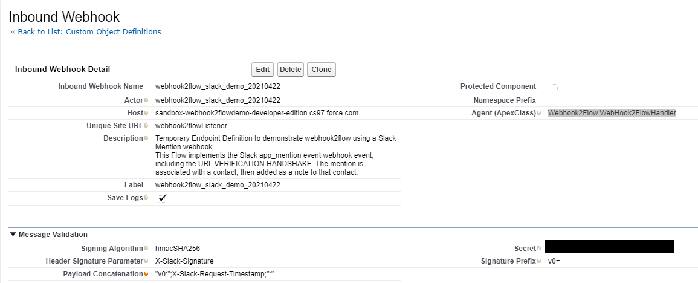

Slack has a two-stage authorization of endpoints and validation of requests

1. A challenge to the endpoint to make sure the Slack App developer actually controls/provides that endpoint
2. Signed Secret Verification (HMAC validation) for each message.

For this example, we need two steps in the this definition - a minimum to allow the challenge, then the full Message Validation information once the challenge is accepted.

---
For the Slack Mention example, the essential fields are:

1. **Inbound Webhook Name** - the unique name for this particular inbound webhook service
2. **Actor** - The name of the servicer (usually the DeveloperName of the Flow) that will handle the inbound webhook requests
3. **Host** - This is the site base address which can be obtained from the base Default Web Address (no HTTP or HTTPS)s.  (example: yourdomain.my.salesforce.com)
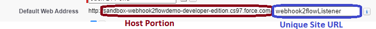

4. **Unique Site URL** - The unique URL for this site. [Salesforce.com](http://Salesforce.com/) provides the first part of the URL; you create the suffix using only alphanumeric characters in the site Default Web Address.  This is addition security when multiple webhooks are attached to the same site - if you use it, it will query the site and make sure the Client accessing is the default user for that site.  If you create multiple Site endpoints, you should use this parameter for each endpoint.
5. **Description** - always a good administrative practice
6. **Agent(Apex Class)** - The agent that is actually the engine for webhook2flow.  Right now this defaults to **Webhook2Flow.WebHook2FlowHandler** and is reserved for future use for more complex handlers (if needed).
7. **Label** - This is a required fiel by Salesforce, but not used for Webhook2flow.
8. **Save Logs** - Webhook2flow has a built in logging capability.  This is useful for debugging - and sometimes to discover what the actual payload is (versus what is published).  Like any logging tool, it consumes space and presents certain security risks.

For the Slack example, slack also requires the Request URL to be verified using challenge flow.  Slack sends an HTTP POST request with a challenge parameter to the URL you&#39;ve specified, and your endpoint must respond with the challenge value. [Learn more.](https://api.slack.com/events/url_verification)  This means your flow needs a challenge path which returns the challenge parameter.  After the challenge has been passed, Slack provides additional information (The Secret) you will use to set up this endpoint.
9. **Signing Algorithm** - The algorithm used to create the hash digest signature (Message Authentication code or MAC) used to validate the message.  Currently supported are: hmacMD5, hmacSHA1,hmacSHA256,and hmacSHA512
10. **Header Signature Parameter** - The name of the parameter passed in the request header that contains the Signature (Hashed Digest) as calculated by the sender to be matched with the one calculated by the receiver. For Slack, the parameter is: "X-Slack-Signature"
11. **Secret** - Confirm each request by verifying its unique signature.  This is copied directly from the initiating webhook configuration
12. **Signature Prefix** - some webhooks pass the Signature with a prefix.  While not used in the Slack example, GitHub uses "sha256=" for digests encrypted as hmacSHA256 and "sha1=" for those using hmacSHA1(GitHub - [Securing your webhooks](https://docs.github.com/en/developers/webhooks-and-events/securing-your-webhooks))

 There are other parameters that may be necessary to verify the unique signature.  For the Slack example, see [Verifying requests from Slack](https://api.slack.com/authentication/verifying-requests-from-slack), They include:
13. **Payload Concatenation** - Often used to prevent replay, the payload can be concatenated with both constant and header/parameter information before it is signed.  For Slack this is:
  1. **Payload Concatenation**

    "v0:";X-Slack-Request-Timestamp;":"

webhook2flow parses this request as 3 different parameters separated by a semicolon (;). Parameters enclosed in quotes (") are taken as constant values, and there are two of those, "v0:" and ":".  Those not enclosed are assumed to be header parameters and are merged as such and there is one of these, X-Slack-Request-Timestamp.  The body is always assumed final component.  So for the Slack example, this would be a string:

V0:[whatever is in the X-Slack-Request-Timestamp header parameter]:[Request Body]

1. There are additional advanced parameters which will be discussed in the reference section - but are not needed for this example implementation.

### 4. Create the Webhook2flow Data Interface (in Flow Builder)

Webhooks usually communicate in JSON data structures (often called payloads).  These data structures are defined completely in Flow Builder by defining the variables and designating them as Available for Input  for the request payload and Available for Output for the response payload.

For this example, you will actually need to implement two flow paths, he Slack [URL VERIFICATION HANDSHAKE](https://api.slack.com/apis/connections/events-api) (to authorize this endpoint as a valid webhook destination), and the Slack [app_mention](https://api.slack.com/events/app_mention) webhook flow path.

The Slack Payload for [URL VERIFICATION HANDSHAKE](https://api.slack.com/apis/connections/events-api) webhook is:

**URL VERIFICATION HANDSHAKE**
```json
{
    "token": "Jhj5dZrVaK7ZwHHjRyZWjbDl",
    "challenge": "3eZbrw1aBm2rZgRNFdxV2595E9CY3gmdALWMmHkvFXO7tYXAYM8P",
    "type": "url_verification"

}
```
---
and the Slack [app_mention](https://api.slack.com/events/app_mention), request payload is defined as - but the documentation is wrong.  More on this later

**JSON Request**
```json
    {
        "type": "app_mention",
        "user": "U061F7AUR",
        "text": "<@U0LAN0Z89> is it everything a river should be?",
        "ts": "1515449522.000016",
        "channel": "C0LAN2Q65",
        "event_ts": "1515449522000016"
    }
```
---

### 5. Use Flow Builder to Service the request and build any needed response

The input fields will be populated from the request.  Use those variables as you would in any flow to fulfill the request  For example, in this instance, you may want to create a note on a contact every time a user @ references the Salesforce System in a channel.  In this example we actually need two service flows; one to return the challenge necessary to establish the URL as a valid endpoint for Slack, then the second to process the actual [app_mention](https://api.slack.com/events/app_mention).

**_REMEMBER_** :  _The Flow must be_ **_ACTIVATED_** _before it can be used by webhook2flow._

#### Implement the Slack [URL VERIFICATION HANDSHAKE](https://api.slack.com/apis/connections/events-api) flow path

The Slack [URL VERIFICATION HANDSHAKE](https://api.slack.com/apis/connections/events-api) is actually it&#39;s own little webhook, and as simple as it gets for logic.  This handshake is a post to the URL defined for the webhook event, and the flow logic is as simple as it gets; if the "type" == "url_verification", return the "challenge" to the requestor.

The steps are:

1. Create two new Resources - ResourceType = Variable, DataType=Text, with API names "challenge" and "type".  Both of these are selected as "Available for Input" and "challenge" is also "Available for Output".
2. Add a decision checking if the "type" == "url_verification", and if so, done.  (You don&#39;t have to set the "challenge", because you&#39;ve already designated it as "Available for Output", so it will be what it was when passed in as "Available for Input".
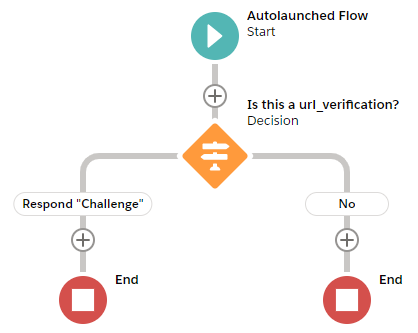

**Voilà** - you&#39;re done with the url_verification flow.  If Slack posts to the defined endpoint with the above "url_verification" request, the flow returns the "challenge" value.

---

### Implement the Slack [app_mention](https://api.slack.com/events/app_mention) payload interface

First some issues:

1. The documented payload is incorrect - this was discovered by examining the payload actually sent using the logger.  The REAL payload follows.
2. This payload actually sent includes Complex Object types (_event, blocks, elements,_ and _authorizations_).  We&#39;re only going to use _event,_ but we&#39;ll need to create this using an invocable class (the only option currently available)

What we&#39;ll be doing is matching the UserID to a created contact

The steps are:

1. Create the resources needed for this webhook (team_id,api_app_id,type, event_id, is_ext_shared_channel,event_context)  All of these are selected as "Available for Input".
2. Create the _event_ Complex Object as an Invocable Class (see below).  After you create it, it will be visible as an Apex-Defined Object.  The key fields needed in that object will be **_text,_** and **_user,_** and add a note to the Contact identified with the custom field SlackUserId__c.
3. Add the event as a resource
4. Create the logic to associate the [app_mention](https://api.slack.com/events/app_mention) webhook event with an existing contact and add the message to that contact as a Note.

**app_mention payload**
```json
    {
        "token": "HMomSTnOLtuEpR2hrcUa993H",
        "team_id": "T07GC5A2Z",
        "api_app_id": "A01UY6TE6F8",
        "event": {
            "client_msg_id": "9268eff7-6a56-46f6-b02d-1af33eebd2fa",
            "type": "app_mention",
            "text": "Test 24",
            "user": "U07GBPGJJ",
            "ts": "1619718245.003800",
            "team": "T07GC5A2Z",
            "blocks": [
                        {
                            "type": "rich_text",
                            "block_id": "bFJ",
                            "elements": [
                                            {
                                                "type": "rich_text_section",
                                                "elements": [
                                                                {
                                                                    "type": "user",
                                                                    "user_id": "U0204UN581F"
                                                                },
                                                                {
                                                                    "type": "text",
                                                                    "text": "Test 24"
                                                                }
                                                            ]
                                            }
                                        ]
                        }
                    ],
                    "channel": "C01VD6U6UG3",
                    "event_ts": "1619718245.003800"
            },
        "type": "event_callback",
        "event_id": "Ev020FV4A19Q",
        "event_time": 1619718245,
        "authorizations": [
                            {
                                "enterprise_id": null,
                                "team_id": "T07GC5A2Z",
                                "user_id": "U0204UN581F",
                                "is_bot": true,
                                "is_enterprise_install": false
                            }
        ],
        "is_ext_shared_channel": false,
        "event_context": "1-app_mention-T07GC5A2Z-C01VD6U6UG3"
}
```
---
Couple of notes on the "REAL" payload for the Slack [app_mention](https://api.slack.com/events/app_mention) webhook event:

1. The above definition is completely wrong.
2. The "flat" level parameters are:
  1. token
  2. team_id
  3. api_app_id
  4. type
  5. event_id
  6. event_time
  7. is_ext_shared_channel
  8. event_context
3. There are 4 complex objects in this payload
  1. event - YOU HAVE TO HAVE THIS ONE.  It contains all the real information you are looking for
  2. blocks(collection/array)
  3. elements(collection/array)
  4. authorizations(collection/array)
4. Don&#39;t worry about creating variables or invocable variables for any of the ones you don&#39;t want/need - if you don&#39;t define them, they will just be ignored.

Sooooo, for this example, we HAVE to create a complex object (event).

We looked at three different ways to do this, but for now, the  available option is to create an Apex-Defined Object using an invocable class.  The class can be called anything (in this example, it is called slack_event), but many webhooks use the same names for complex objects (example: event, user, . . . appear in webhooks exposed for Slack, Github, Gitlab, Jira).  As a best practice, you may want to use the event publisher as a prefix for the complex object.  Example: slack_event, github_event, jira_event, . . .

After you have created the invocable class ([see Below](/confluence/pages/createpage.action%3FspaceKey=SUD&amp;title=slack_eventCode&amp;linkCreation=true&amp;fromPageId=87064620)), it will appear in the drop-down when you&#39;ve specified the object type as Apex-Defined:

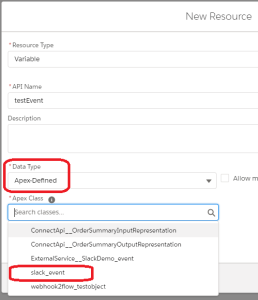

**event invocable class**
```javascript
public inherited sharing class slack_event{

    @invocableVariable(label=&#39;type&#39; )
    @AuraEnabled
    public String type;

    @invocableVariable(label=&#39;channel&#39; )
    @AuraEnabled
    public String channel;

    @invocableVariable(label=&#39;user&#39; )
    @AuraEnabled
    public String user;

    @invocableVariable(label=&#39;text&#39; )
    @AuraEnabled
    public String text;

    @invocableVariable(label=&#39;ts&#39; )
    @AuraEnabled
    public String ts;

    @invocableVariable(label=&#39;team&#39; )
    @AuraEnabled
    public String team;

}
```
**Voilà** - you&#39;re done with the [app_mention](https://api.slack.com/events/app_mention)flow path.  If the Slack [app_mention](https://api.slack.com/events/app_mention) webhook event posts to the defined endpoint with the above [app_mention](https://api.slack.com/events/app_mention)  request, the flow adds it to the contact as a note.

### Implement the Slack [app_mention](https://api.slack.com/events/app_mention) servicing logic

Add the logic to service the webhook payload request when received.  Illustrated here is:

1. Enable the endpoint to use Secret Signing Validation  Inbound Webhook Custom Object instance settings:
  1.  Signing Algorithm - hmacSHA256
  2. Header Signature Parameter    X-Slack-Signature
  3. Payload Concatenation    "v0:";X-Slack-Request-Timestamp;":"  (this is the prefix definition concatenated with the body to generate a valid signature which will match the contents of header parameter X-Slack-Signature)
    1. "v0:" - a constant defined by Slack (as defined by the double quotes)
    2. X-Slack-Request-Timestamp - a parameter passed in the request header as specified by Slack
    3. ":" - a constant (in this case delimiter) before concatenating body (as defined by the double quotes)
  4. Secret    -  XXXXXXXXXXXXXXXXXXXXXX (the 32 character signing secret provided by slack for this webhook event in the Slack API → Basic Information → App Credentials → Signing Secret
2. Lookup the User in Contacts to determine which Contact to apply the mention to as a note
3. Create the note and attach it to the Contact
4. Error processing (optional)
5. Validate that note was added

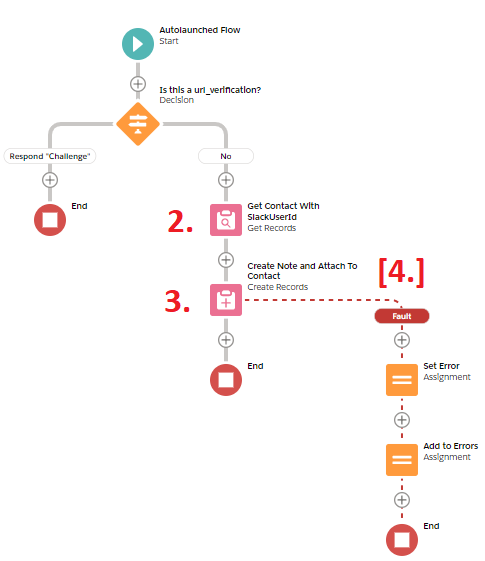

**And when executed, will attach to Contact**

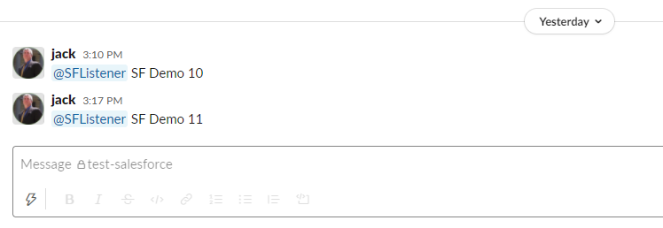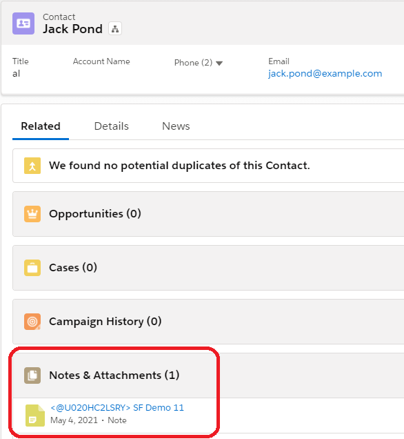

## Advanced Technical Information and Capabilities

### DataType Capabilities and Restrictions

1. Available
  1. Collections (including collections of objects)
  2. sObject (including custom objects)
  3. String
  4. Number
  5. Boolean
  6. DateTime
  7. Date
2. **NOT Available (Yet)**
  1. Null as string (problem with JSON parser)
  2. Blob
  3. Integer

### Specifying the HTTP Response StatusCode

By default, Webhook2Flow returns a StatusCode of 200 if successful, or 400 if not.  You can override this using a custom parameter (DataType Number)   **_Webhook2Flow_RestResponse_statusCode_** (and making it "Available for output") from your flow,   If defined in the flow and null, it will use the defaults.  If set, it will be used as the response.statusCode.  The status code you return should be one acceptable to the webhook, but you can check [here](https://httpstatuses.com/) for a list of common usage.

**Exceptions and Error Processing**

OK, if you are one of those extraordinarily rare developers who provides meaningful errorsand error messages - even if those users are on different systems (yes, both of you, you know who you are), you can return this information from your flow.  This is done by creating a collection of FlowExecutionErrorEvent objects (and making it "Available for output") and adding each error you wish to return.  If the collection has no members, it is assumed no error occurred.

#### Flow Error Example

In this example, adding a record caused an error.  This error is
returned in the body of the response.

Steps:

1. Create a FlowExecutionErrorEvent record collection and make that collection "Available for output".  In this example it was named _errorCollection_
2. Create a FlowExecutionErrorEvent record variable to be used in assignments
3. Introduce Flow logic that detects the error condition (in this example a fault condition from a record insert)
4. Define the error (two fields in the FlowExecutionErrorEvent record variable- ErrorMessage and ErrorId)
5. Add the defined FlowExecutionErrorEvent record variable to the FlowExecutionErrorEvent record collection
6. TEST

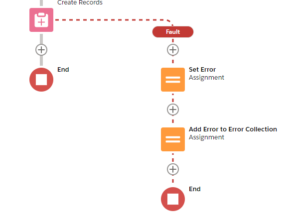<br/>
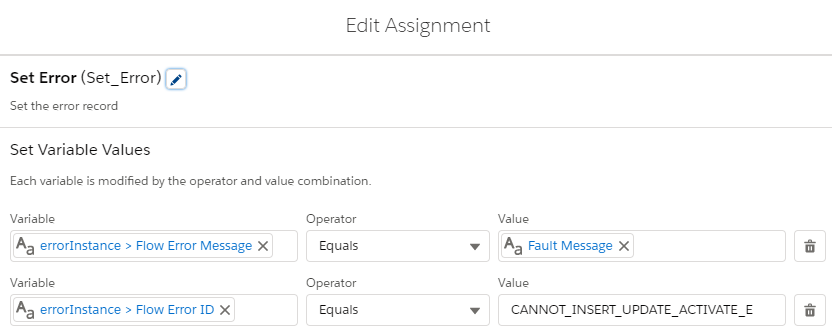<br/>
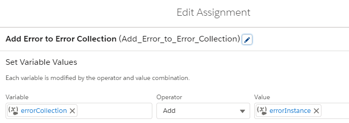<br/>
<br/>

If you&#39;re looking for an ErrorId to return, you may want to look at those already defined in your instance at: [https://[yourinstance].my.salesforce.com/services/wsdl/tooling](https://inspiration-power-78282-dev-ed.cs68.my.salesforce.com/services/wsdl/tooling) under <xsd:simpleType name="StatusCode">.

-   [Defining Connected
    Apps](https://developer.salesforce.com/docs/atlas.en-us.api_rest.meta/api_rest/intro_defining_remote_access_applications.htm)

- [Enabling Webhooks to Launch Flows](https://quip.com/VoMrASkiH7PO/Enabling-Webhooks-to-Launch-Flows)
- [Connected Apps](https://developer.salesforce.com/docs/atlas.en-us.securityImplGuide.meta/securityImplGuide/connected_apps.htm)
- [Connected App Use Cases](https://help.salesforce.com/articleView?id=connected_app_about.htm&amp;language=en_US)
- [Create a Connected App](https://help.salesforce.com/articleView?id=connected_app_create.htm&amp;language=en_US)
-  [Identity Basics Trailhead Module](https://trailhead.salesforce.com/content/learn/modules/identity_basics)
- [Connected AppBasics](https://trailhead.salesforce.com/en/content/learn/modules/connected-app-basics)
- [Build a Connected App for API Integration](https://trailhead.salesforce.com/content/learn/projects/build-a-connected-app-for-api-integration)
- [OAUTH 2.0 Authentication](https://swagger.io/docs/specification/authentication/oauth2/)
- [OAuth Authorization Flows](https://help.salesforce.com/articleView?id=sf.remoteaccess_oauth_flows.htm&amp;type=5)
- [OAuth 2.0 Web Server Flow for Web App Integration](https://help.salesforce.com/articleView?id=sf.remoteaccess_oauth_web_server_flow.htm&amp;type=5)
- [Create a Connected App for Your Dev Hub Org](https://developer.salesforce.com/docs/atlas.en-us.sfdx_dev.meta/sfdx_dev/sfdx_dev_auth_connected_app.htm)
- [Defining Connected Apps](https://developer.salesforce.com/docs/atlas.en-us.api_rest.meta/api_rest/intro_defining_remote_access_applications.htm)
- [Digging Deeper into OAuth 2.0 in Salesforce](https://help.salesforce.com/articleView?id=remoteaccess_authenticate_overview.htm&amp;type=5)
