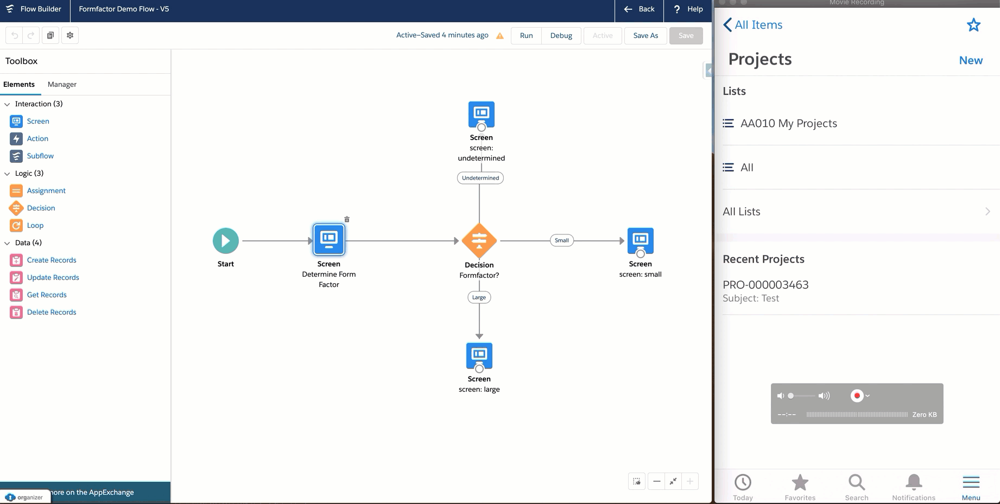

# sfdx-flow-formfactor-helper-lwc
Lightning Web Components which determines the form factor in which it is executing, and will (optionally) automatically navigate. This utility allows Flows to be designed with the form factor in mind. Does a Flow not (yet) support running in a Mobile (=small) form factor? You can branch based on the form factor and show a descent message to the user. Do you want a certain screen element to be responsive to the form factor? 

Install it in your Sandbox using https://test.salesforce.com/packaging/installPackage.apexp?p0=04t4I000000pP83
Install it in your Production org using https://login.salesforce.com/packaging/installPackage.apexp?p0=04t4I000000pP83

